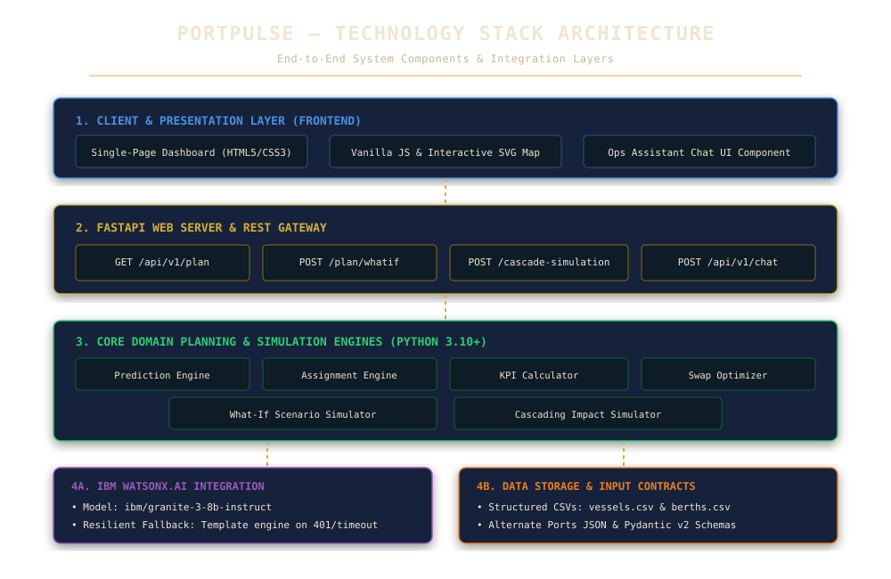

# PortPulse — Container Congestion Predictor & Port Operations Optimiser

[](https://github.com/Jigar-CS/bob-ai-hackathon-Team-Surfers/actions/workflows/ci.yml)
[](https://www.python.org/downloads/)
[](LICENSE)

---

## 👥 Team

| Field | Value |
|---|---|
| **Team Name** | Team Surfers (ABC) |
| **Track** | AI |
| **Category** | Logistics & Ports — L1 Container Congestion Predictor & Port Operations Optimiser |
| **Team Lead** | Hetvi Tank — `hetvitaank07@gmail.com` |
| **Members** | Trusha Patel, Jigar Sakhia, Priyansh Sukhdia |

---

## 🎯 Problem Statement

The 2021 LA/Long Beach port backlog had 100+ ships waiting offshore for weeks, costing global supply chains over $10 Billion. Today, port operators allocate berths, cranes, and yard space across hundreds of incoming vessels manually in spreadsheets. Congestion hotspots are identified reactively — after vessels are already queuing in deep water — and alternate port routing decisions come too late for shift supervisors to take preventative action. Every hour of delay ripples across regional logistics networks, compounding berth conflicts, demurrage penalties, and fuel burn.

---

## 💡 Solution

**PortPulse** is an enterprise AI port operations optimization and congestion prediction platform. It predicts 72-hour congestion hotspots using vessel arrival schedules and berth capacity, generates priority-based berth & crane allocations, simulates What-If scenarios and cascading disruptions, dynamically computes marine weather delay adjustments, and provides plain-language reroute reasoning powered by **Google Gemini API** (`gemini-flash-latest`) and **IBM watsonx.ai** (`ibm/granite-3-8b-instruct`).

It features an interactive Conversational **Ops Assistant** (`/api/v1/chat`), trained **scikit-learn ML models** for wait time & demurrage forecasting, a **Global Port Selector & Coordinate Manager**, and a side-panel admin dashboard with an interactive SVG vessel map.

---

## 🖼️ System & Feature Flowcharts

### 1. Technology Stack Flowchart


### 2. Website & Dashboard Feature Map Flowchart


### 3. Cascading Impact Simulation Workflow


---

## ✨ Key Features

- **72-Hour Congestion Risk Forecasting**: Buckets incoming arrivals into rolling 24-hour windows from earliest ETA, comparing incoming TEU against total berth capacity to classify windows as LOW, MEDIUM, or HIGH risk (ALSC risk model).
- **Priority-Based Automated Berth & Crane Allocation**: Sorts vessels by cargo priority (P1/P2/P3), allocating berths and scaling effective dwell time dynamically based on crane availability relative to baseline to optimize berth turnaround time while recording a deterministic, auditable single-line reason for every placement.
- **Dual AI LLM Integration (Google Gemini & IBM watsonx.ai)**: Powered by Google Gemini API (`gemini-flash-latest`) as primary LLM engine with fallback to IBM watsonx.ai (`ibm/granite-3-8b-instruct`) for natural language reroute justifications and conversational answers.
- **Conversational Ops Assistant (`/api/v1/chat`)**: Slide-out AI assistant grounded directly in live 72-hour plan data, featuring pre-LLM scope gating, friendly greeting handling, and strict prompt injection defenses.
- **Real-Time Weather Delay Engine**: Connects to Open-Meteo API to sample marine weather along vessel route waypoints, dynamically adjusting ETAs and updating berth schedules when severe sea weather occurs.
- **Trained Machine Learning Models**: Built-in `scikit-learn` ML models predicting congestion risk, queue wait duration, demurrage financial penalties, and schedule anomaly detection.
- **Global Port Selector & Coordinate Manager**: Allows shift operators to switch between major international container ports (India, US, UAE, Singapore, Netherlands, Germany, China, Japan, South Korea, Australia) or set custom lat/lon coordinates.
- **KPI Tracking Strip**: Real-time summary strip at the top of the dashboard tracking `Average Queue Wait`, `Berth Capacity Utilization %`, `Vessels at Risk`, and `Estimated Emissions Saved (kg CO2)`.
- **Top 5 Optimization Techniques (Berth Swap Optimizer)**: Evaluates pairwise berth swaps to prioritize high-priority cargo and reduce queue wait times, displaying the top 5 high-impact suggestions with exact demurrage cost savings.
- **What-If Scenario Simulator (`POST /api/v1/plan/whatif`)**: Sandboxed scenario comparison for vessel arrival delays or berth outages with side-by-side diff reporting.
- **Cascading Impact Simulator (`POST /api/v1/cascade-simulation`)**: Traces multi-pass queue ripple effects across vessel schedules with a waterfall timeline and financial demurrage cost analysis.
- **Side-Panel Admin Dashboard & Live Nautical Map**: Professional ops tool UI featuring tabbed navigation (Dashboard, Berth Allocation, Reallocation & Routing, Vessel Map), top-mounted CSV upload/export controls, and interactive SVG schematic vessel map with hover tooltips.
- **Zero-Downtime Fallback Architecture**: Isolated engine execution ensures AI API rate limits or missing keys degrade gracefully to structured template text without ever failing plan generation or returning HTTP 500 errors.

---

## 🛠️ Tech Stack

| Category | Technologies |
|---|---|
| **Languages** | Python 3.10+, JavaScript (ES6+), HTML5, CSS3 |
| **Frameworks** | FastAPI, Pydantic v2, Pydantic Settings |
| **AI LLM Engines** | Google Gemini API (`gemini-flash-latest`), IBM watsonx.ai (`ibm/granite-3-8b-instruct`), IBM Bob |
| **Machine Learning** | scikit-learn, joblib, NumPy, pandas |
| **Weather Integration** | Open-Meteo REST API (route waypoints sampling) |
| **Databases / Storage** | File-based CSV Datasets (`vessels.csv` & `berths.csv`), SQLAlchemy / PyMySQL |
| **DevOps & Tooling** | Uvicorn, Docker, GitHub Actions CI/CD, Pytest (246 tests, 100% pass rate), Ruff, Mypy |

---

## 📁 Repository Structure

```text
├── src/                      # Source code directory
│   └── portpulse/            # PortPulse core package
│       ├── api/              # FastAPI endpoints (plan, datasets, health, security)
│       ├── data/             # Bundled CSV datasets (vessels.csv, berths.csv, alternate_ports.json)
│       ├── domain/           # Framework-free core logic (planner, prediction, assignment, swap_optimizer, kpi_calculator, whatif_simulator, cascade_simulator, routing, chat, summary, port_directory)
│       ├── integrations/     # AI REST clients (Gemini REST client, IBM watsonx.ai client, Open-Meteo weather)
│       ├── ml/               # Machine Learning predictors (congestion, wait time, demurrage, anomaly detection)
│       └── static/           # Operations dashboard single-file frontend (index.html)
├── docs/                     # Comprehensive written documentation
│   ├── problem-statement.md  # Detailed domain problem analysis
│   ├── solution-overview.md  # End-to-end system architectural overview
│   ├── architecture.md       # Layered design, Mermaid diagrams, data flow & security posture
│   ├── api.md                # Full OpenAPI specification & error taxonomy
│   ├── setup-guide.md        # Local, Docker, and environment setup guide
│   └── images/               # Flowcharts and architecture diagrams (SVG format)
├── demo/                     # Hackathon demo artifacts
│   ├── screenshots/          # 10 High-resolution application screenshots
│   ├── demo-video-link.txt   # Link to demo video recording
│   └── live-demo-url.txt     # Link to live deployed application
├── presentation/             # Slide deck and presentation materials
├── scripts/                  # Utility scripts (e.g., generate_50_samples.py, train_models_enhanced.py)
├── tests/                    # Pytest test suite (246 tests, 100% pass rate)
├── requirements.txt          # Python runtime dependencies
├── pyproject.toml            # Tooling configuration (Ruff, Mypy, Pytest, Coverage)
├── Dockerfile                # Multi-stage container build spec
└── submission.yaml           # Structured hackathon submission metadata
```

---

## ⚡ How to Run

```bash
# 1. Clone the repository
git clone https://github.com/Jigar-CS/bob-ai-hackathon-Team-Surfers.git
cd bob-ai-hackathon-Team-Surfers

# 2. Create and activate a virtual environment (Python 3.10+ recommended)
python -m venv .venv
source .venv/bin/activate          # On Windows: .venv\Scripts\activate

# 3. Install dependencies
pip install -e ".[dev]"

# 4. Configure environment variables (Google Gemini API & IBM watsonx.ai)
cp .env.example .env
# Edit .env to set GEMINI_API_KEY (from https://aistudio.google.com/) and/or WATSONX_API_KEY
# Note: If keys are not set, PortPulse seamlessly uses intelligent rule-based fallbacks!

# 5. Start the PortPulse application server
python -m portpulse

# 6. Access the web dashboard & API docs
# Web Dashboard:        http://127.0.0.1:8000
# Interactive API Docs: http://127.0.0.1:8000/api/docs

# 7. Run automated verification test suite (246 tests)
pytest tests/
```

---

## 🖼️ Application Screenshot Roster & Visual Tour

| # | Screenshot | Description | Link |
|---|---|---|---|
| 01 | **Dashboard Overview** | Operations overview, 72-hour plan summary, KPI tracking strip, and vessel priority breakdown | [01-dashboard-overview.png](demo/screenshots/01-dashboard-overview.png) |
| 02 | **Berth Capacity & Utilization** | Live TEU capacity volume, percentage fill, docked vessel, and queue status per berth | [02-berth-capacity.png](demo/screenshots/02-berth-capacity.png) |
| 03 | **Berth Assignment Plan** | Complete vessel schedule table, crane count, demurrage costs, weather delays, berth start & departure | [03-berth-assignment-plan.png](demo/screenshots/03-berth-assignment-plan.png) |
| 04 | **Reallocation & Rerouting** | Unassigned vessels roster and ranked candidate alternate ports with nautical mile distance & transit times | [04-reallocation-routing.png](demo/screenshots/04-reallocation-routing.png) |
| 05 | **Vessel Ocean Routing Map** | Live schematic ocean routing corridors connecting international container port hubs | [05-vessel-map.png](demo/screenshots/05-vessel-map.png) |
| 06 | **Ops Assistant AI Chatbot** | Conversational AI Chatbot widget grounded directly in live 72-hour ops plan data | [06-ops-assistant-chatbot.png](demo/screenshots/06-ops-assistant-chatbot.png) |
| 07 | **Weather Delay Feed** | Real-time weather delay engine & dynamic berth re-allocation audit log | [07-weather-impact-feed.png](demo/screenshots/07-weather-impact-feed.png) |
| 08 | **Global Port Selector** | International port selector & coordinate manager supporting global port hubs | [08-global-port-selector.png](demo/screenshots/08-global-port-selector.png) |
| 09 | **Berth Map Detail** | High-resolution harbor anchorage and vessel berth mapping | [09-berth-map-detail.png](demo/screenshots/09-berth-map-detail.png) |
| 10 | **72-Hour Congestion Forecast** | Rolling 24-hour risk level classification comparing inbound TEU vs berth throughput capacity | [10-congestion-forecast.png](demo/screenshots/10-congestion-forecast.png) |

---

## ⚠️ Known Limitations

- **Greedy Priority-First Allocator**: The berth scheduler uses a greedy priority-first placement heuristic rather than global Mixed-Integer Linear Programming (MILP). While fast, explainable, and deterministic, it may not find the global mathematical optimum.
- **Synthetic CSV Datasets**: Operates on structured synthetic CSV datasets (`vessels.csv` and `berths.csv`) rather than a live real-time AIS marine satellite telemetry stream or Terminal Operating System (TOS) API feed.
- **Fixed Candidate Port Pool**: Alternate port routing recommendations evaluate a fixed regional candidate pool (Port of Oakland, Port of Tacoma, Port of Ensenada) based on draft capacity and nautical distance.

---

## 🏅 What We're Most Proud Of

- **Honest, Evidence-Grounded Dual AI**: Applied AI reasoning via Google Gemini API (`gemini-flash-latest`) and IBM watsonx.ai (`ibm/granite-3-8b-instruct`) specifically where human language adds genuine value — explaining complex rerouting trade-offs and answering shift supervisors' operational queries in plain English — rather than as a decorative wrapper.
- **Zero-Downtime Fallback Design**: Isolated engine execution ensures that AI rate limits, missing keys, or network failures instantly degrade to clean, structured template text without ever breaking the 72-hour ops plan or returning HTTP 500 errors.
- **Clean Architecture & 100% Test Pass Rate**: Built a framework-free domain layer with 246 unit and API integration tests (100% pass rate), strict security posture (HMAC API key auth, streaming upload limits, CSP headers, rate limiting), and a responsive admin dashboard featuring interactive SVG nautical chart visualisations.
