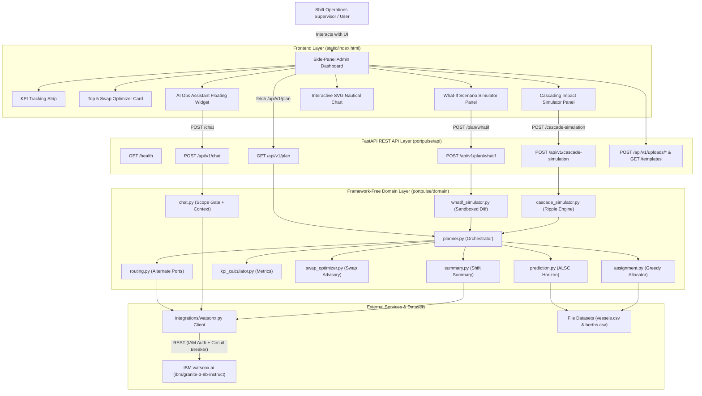
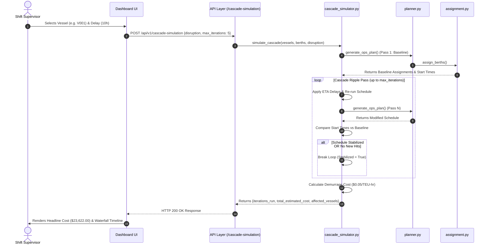

# PortPulse — System Architecture & Design Specification

## Overview

PortPulse is built on a clean, layered architecture with strict inward dependency rules. The domain layer contains zero web framework code and can execute in complete isolation. The API layer (FastAPI) handles request routing, validation, security headers, rate limiting, and HTTP error mapping.

---

## 🏗️ System Layer Architecture (Mermaid)

---

## 🔄 Cascading Impact Simulation Data Flow (Mermaid)

---

## 🛠️ Components & Module Responsibilities

| Component | Module | Responsibility |
|---|---|---|
| **Application Factory** | `app.py` | Builds FastAPI app instance, registers CORS middleware, rate limiters, security headers, and static mount (`/`). |
| **Configuration** | `config.py` | Environment settings validator using Pydantic Settings across `PORTPULSE_*` and `WATSONX_*` namespaces. |
| **Schemas** | `schemas.py` | Data contracts (`OpsPlan`, `BerthAssignment`, `SwapOpportunity`, `CascadeRequest`, `WhatIfRequest`, `KpiSummary`). |
| **Congestion Engine** | `domain/prediction.py` | Buckets arrivals into 24h rolling windows and computes ALSC risk levels (LOW, MEDIUM, HIGH). |
| **Assignment Engine** | `domain/assignment.py` | Priority-first greedy berth and crane allocation algorithm with deterministic decision reasons. |
| **KPI Calculator** | `domain/kpi_calculator.py` | Computes average wait hours, berth utilization %, vessels at risk, and CO2 emissions saved. |
| **Swap Optimizer** | `domain/swap_optimizer.py` | Identifies pairwise berth swaps to reduce P1 queue wait times and calculates demurrage cost savings. |
| **What-If Simulator** | `domain/whatif_simulator.py` | Sandboxed simulation engine comparing baseline vs scenario diffs without mutating live data. |
| **Cascade Simulator** | `domain/cascade_simulator.py` | Multi-pass schedule ripple engine tracing downstream delays and financial demurrage impact. |
| **Routing Engine** | `domain/routing.py` | Ranks regional alternate ports (distance/fit) and uses IBM watsonx.ai to generate plain-language justifications. |
| **Conversational Assistant** | `domain/chat.py` | Scope-gated AI assistant answering operator questions grounded in live 72-hour ops plan data. |
| **watsonx.ai Client** | `integrations/watsonx.py` | IAM authentication, token caching, exponential retries with jitter, and circuit breaker fallback. |

---

## 🖼️ Architecture & Workflow Visual Diagrams

- **[Tech Stack Flowchart](images/tech_stack_flowchart.svg)**: Complete breakdown of presentation, web server, domain engine, and IBM watsonx.ai integration layers.
- **[Website & Dashboard Feature Map](images/website_feature_flowchart.svg)**: Map of side-panel navigation layout, 4 tabs, simulation controls, and floating chat assistant.
- **[Cascading Impact Simulation Workflow](images/cascading_simulation_workflow.svg)**: Detailed step-by-step workflow of multi-pass schedule ripple analysis.

---

## 🔒 Security Posture

| Security Dimension | Implementation |
|---|---|
| **Authentication** | `X-API-Key` header verified via `hmac.compare_digest` for write endpoints (`/plan/custom`, `/uploads/*`, `/chat`). |
| **Prompt Injection Defense** | Pre-LLM keyword scope gate rejects off-topic queries; vessel input text is stripped of control characters and length-capped. |
| **Rate Limiting** | Sliding 60-second window rate limiter (30 req/min per IP) on POST endpoints. |
| **HTTP Security Headers** | Injects `Content-Security-Policy`, `X-Content-Type-Options`, `X-Frame-Options`, `Referrer-Policy`, and `Permissions-Policy`. |
| **Zero-Downtime Fallback** | Isolated engine execution degrades watsonx.ai network or auth failures to structured template text without returning 500 errors. |
