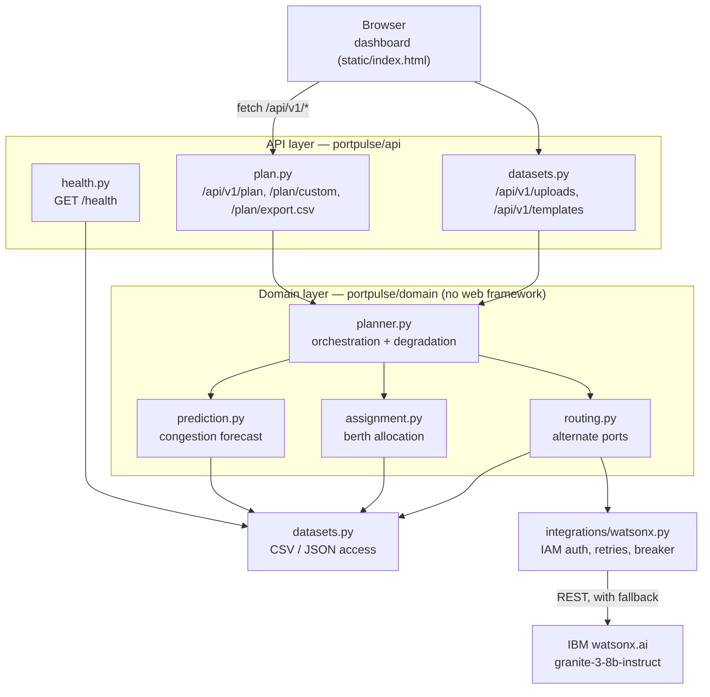

# Architecture

## Layers

The dependency direction is strictly inward: `api/` depends on `domain/`, and
`domain/` depends on neither FastAPI nor `api/`. The domain layer raises
exceptions from `portpulse.errors`; the API layer is the only place that knows
about HTTP status codes.

## Components

| Component | Module | Responsibility |
|---|---|---|
| Application factory | `app.py` | Builds the app, registers middleware, exception handlers, routers and the static mount; runs startup safety checks. |
| Configuration | `config.py` | Typed settings across two env namespaces (`PORTPULSE_*`, `WATSONX_*`) with a cached singleton. |
| Schemas | `schemas.py` | Request validation and response contracts, which also generate the OpenAPI schema. |
| Congestion engine | `domain/prediction.py` | Buckets arrivals into rolling 24-hour windows and compares TEU against capacity. |
| Assignment engine | `domain/assignment.py` | Priority-first greedy berth allocation with per-decision reasons. |
| Routing engine | `domain/routing.py` | Ranks alternate ports, builds prompts, parses replies, bounds LLM fan-out. |
| Orchestrator | `domain/planner.py` | Runs the three engines, isolating each failure into a warning. |
| Dataset access | `datasets.py` | Reads the CSV and JSON datasets; the seam for a future database or live feed. |
| watsonx client | `integrations/watsonx.py` | IAM token caching, retries with jitter, auth circuit breaker, error taxonomy. |
| Middleware | `middleware.py` | Request correlation IDs and access logging. |
| Dashboard | `static/index.html` | Single-file UI, no build step; all interpolated values HTML-escaped. |

## Data flow

1. The dashboard requests `GET /api/v1/plan`.
2. `datasets.py` loads `vessels.csv` and `berths.csv` from the configured data directory.
3. `prediction.py` buckets arrivals into rolling 24-hour windows from the earliest
   ETA and classifies each window LOW / MEDIUM / HIGH against total capacity.
4. `assignment.py` sorts vessels by priority then ETA and places each at the berth
   that frees up earliest and has sufficient capacity, provided the queue wait stays
   within `PORTPULSE_MAX_BERTH_WAIT_HOURS`.
5. Anything unplaceable goes to `routing.py`, which ranks alternate ports by
   capacity fit and distance and asks watsonx.ai to explain the recommendation.
6. `planner.py` assembles one response, validated against `OpsPlan` before it
   leaves the process.

## Failure behaviour

Partial results beat an error page for an operator mid-shift, so degradation is
explicit at every level:

| Failure | Behaviour |
|---|---|
| watsonx.ai unconfigured, unreachable, or returns unparseable text | Deterministic template text; `ai_generated: false`. The plan is unaffected. |
| One engine raises | That section is empty, the rest of the plan is returned, and `warnings` explains what is missing. |
| Datasets missing | `503` from `/health` and `/api/v1/plan`, with the remediation command in the message. |
| Unexpected exception | `500` with a request-ID reference only; internal details go to the logs, never the response. |

## Security posture

| Concern | Approach |
|---|---|
| Credentials | Read from the environment or a gitignored `.env`. `.dockerignore` excludes `.env`, so a local file is never baked into an image. |
| Write endpoints | `X-API-Key` via `hmac.compare_digest`. Production startup fails without a key. |
| CORS | Explicit allowlist defaulting to localhost. Wildcards are rejected in production. |
| Uploads | Extension check, streamed size limit, UTF-8 validation, and required-column validation before any parsing. |
| Prompt injection | Vessel-supplied text is stripped of control characters and newlines and length-capped before interpolation into a prompt. |
| Error leakage | Upstream response bodies are logged at DEBUG and never embedded in exception messages or API responses. |
| Container | Non-root user, no development dependencies, dropped capabilities, read-only root filesystem in Compose. |
| Output encoding | Every value the dashboard injects into the DOM passes through an HTML-escaping helper. |

## Scaling notes

- The application is stateless per request and scales horizontally behind a load
  balancer. The IAM token cache is per process, so each replica authenticates once.
- watsonx.ai calls dominate latency. Fan-out is bounded by a worker cap and a
  per-request call budget so a large unassigned set cannot open unbounded connections.
- `GET /api/v1/plan` recomputes everything, including LLM calls. A cache keyed on a
  dataset fingerprint is the obvious next step.
- Replacing CSV with a database means reimplementing `datasets.py` only; the domain
  and API layers are unchanged.
