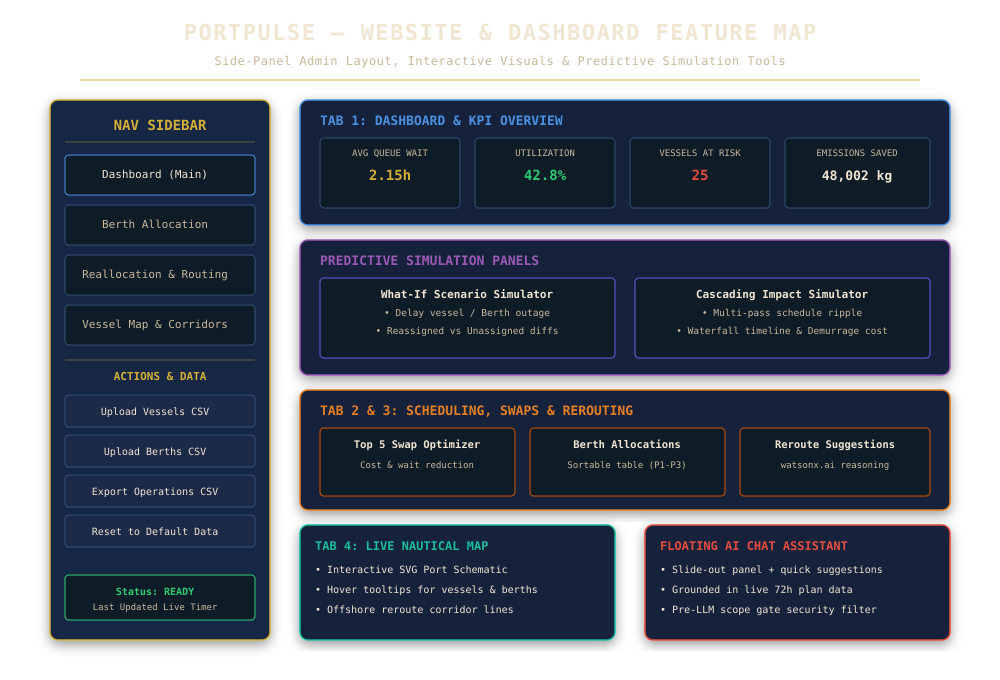
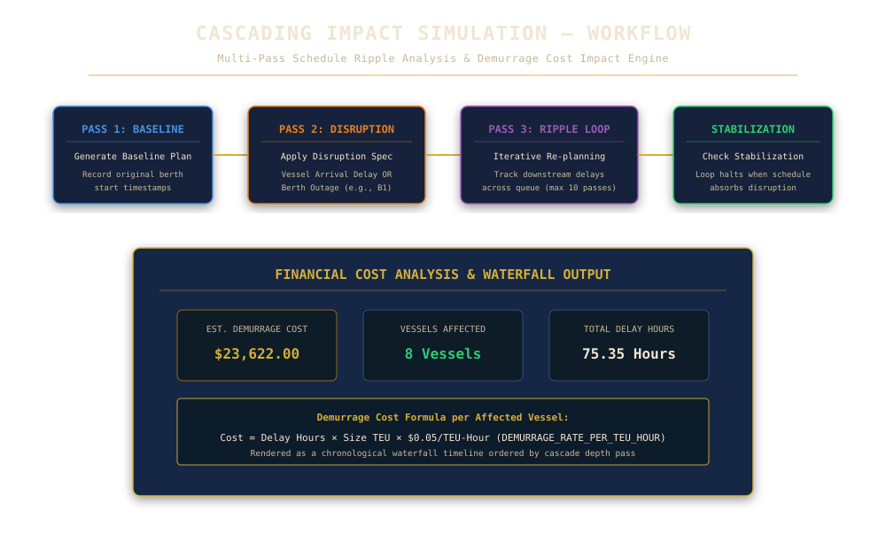

# PortPulse — Solution Overview

## What We Built

PortPulse is an intelligent, AI-driven port operations planning and simulation platform. It ingests vessel arrival schedules and berth capacity data, forecasts 72-hour container congestion risk windows, allocates vessels to berths by cargo priority, provides advisory berth swap optimizations, simulates predictive scenarios (What-If & Cascading Disruptions), integrates marine weather delay forecasts, and recommends alternate port routing with plain-language reasoning powered by **Google Gemini API** (`gemini-flash-latest`) and **IBM watsonx.ai** (`ibm/granite-3-8b-instruct`).

A floating Conversational Ops Assistant lets shift supervisors ask natural-language questions grounded strictly in the live operations plan. The entire system is accessible via a professional side-panel admin dashboard exportable as flat CSV.

---

## 🖼️ System & Feature Flowcharts

### 1. Website & Feature Architecture


### 2. Cascading Disruption Simulation Workflow


---

## How It Works in a Real Terminal

```text
Vessel Schedule CSV + Berth Capacity CSV
                   │
                   ▼
  1. 72-Hour Congestion Forecast (Rolling 24h windows, ALSC risk classification)
                   │
                   ▼
  2. Priority Berth & Crane Allocation (P1/P2/P3 greedy solver + ML predictors)
                   │
                   ▼
  3. KPI Tracking Strip (Avg Wait, Berth Utilization %, Vessels at Risk, CO2 Saved)
                   │
                   ▼
  4. Top 5 Optimization Techniques (Berth Swap Optimizer, $0.05/TEU-hr estimate)
                   │
                   ▼
  5. Predictive Simulators (What-If Diff & Cascading Multi-Pass Ripple Engine)
                   │
                   ▼
  6. Alternate-Port Routing (Gemini & IBM watsonx.ai reasoning for unassigned vessels)
                   │
                   ▼
  7. Interactive Dashboard & Floating AI Ops Assistant (index.html & /api/v1/chat)
```

1. **Ingest**: Ingests vessel schedules and berth capacity files. Supports live custom CSV uploads with automatic column and data validation.
2. **Forecast**: Group arrivals into rolling 24-hour windows from earliest ETA, comparing incoming TEU against total berth capacity to label windows LOW, MEDIUM, or HIGH risk.
3. **Allocate**: Sorts vessels by cargo priority (P1 reefers/perishables first), then ETA. Allocates berths and dynamically scales berth dwell time based on crane availability relative to baseline to optimize turnaround time while recording deterministic, auditable single-line reasons.
4. **KPI Tracking**: Calculates real-time average queue wait, capacity fill percentage, vessels at risk, and CO2 emissions saved.
5. **Optimize**: Identifies high-impact pairwise berth swaps to prioritize time-critical cargo and minimize demurrage costs, presenting the Top 5 advisory techniques.
6. **Simulate**: Provides sandboxed What-If scenario simulation (delays or outages) and multi-pass Cascading Impact simulation with a waterfall ripple timeline and financial demurrage cost analysis.
7. **Reroute**: Matches unassigned vessels against alternate ports (Oakland, Tacoma, Ensenada) ranked by capacity fit and distance, leveraging Google Gemini API and IBM watsonx.ai for plain-language reroute explanations.
8. **Assist**: Conversational AI Assistant (`POST /api/v1/chat`) answers free-text supervisor questions grounded in live plan data, enforced by pre-LLM scope gating.

---

## Key Design Decisions

| Decision | Rationale |
|---|---|
| **Greedy Priority-First Allocator** | Fast, deterministic, and every placement carries an auditable one-line explanation for shift supervisors. |
| **Top 5 Optimization Techniques** | Filters pairwise berth swap options down to the 5 highest-impact suggestions to prevent visual clutter and vessel duplication. |
| **Deliberate Demurrage Rate ($0.05/TEU-hr)** | Conservative, illustrative estimate chosen to keep displayed financial figures realistic and demo-credible ($1k–$25k range). |
| **Multi-Pass Cascade Simulation Guard** | Bounded at 10 iterations max and 500 vessels max to ensure sub-second response times during live operator demos. |
| **Dual AI (Gemini & watsonx.ai) for Reroute & Chat** | Gemini API (`gemini-flash-latest`) and IBM watsonx.ai are used specifically where natural language adds genuine value. Engine failure degrades to template text without breaking plan generation. |
| **Pre-LLM Scope Gate** | Fast keyword filter rejects off-topic queries (sports, weather, code) before calling the LLM, protecting token budget and security posture. |
| **Framework-Free Domain Layer** | Domain logic is written in pure Python without web framework dependencies, supported by 246 unit & API tests (100% pass rate). |

